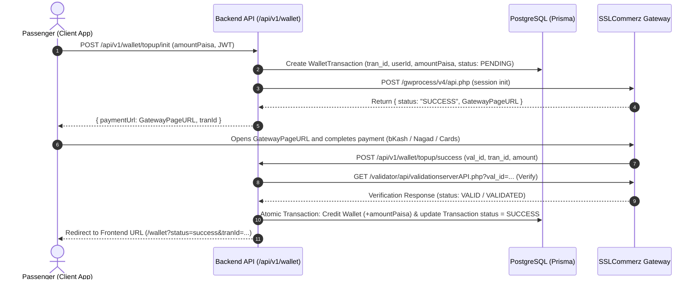

# SSLCommerz Integration Design Spec: TeslaPay Wallet Top-Up

- **Status:** Approved
- **Date:** 2026-10-02
- **Author:** Antigravity & User

---

## 1. Overview & Objectives

Integrate **SSLCommerz Payment Gateway** into the Dhaka Tesla Pool backend to enable passengers to top up their **TeslaPay Wallet** using Bangladesh payment methods (bKash, Nagad, Rocket, Visa/Mastercard, Internet Banking).

### Key Goals:
1. Provide a secure, atomic wallet top-up flow with SSLCommerz hosted checkout (`GatewayPageURL`).
2. Verify all payments on the backend via SSLCommerz validation API (`validationserverAPI.php`) before crediting user balances.
3. Prevent duplicate credit attacks using idempotency on unique `tran_id` and atomic database transactions.
4. Support sandbox testing initially with environment switch (`SSLCOMMERZ_IS_LIVE=false`).

---

## 2. Architecture & Data Flow



---

## 3. Database Schema Changes

In `prisma/schema/wallet.prisma`:

```prisma
enum WalletTransactionStatus {
  PENDING
  SUCCESS
  FAILED
  CANCELLED
}

model WalletTransaction {
  id           String                  @id @default(uuid()) @db.Uuid
  tranId       String                  @unique @map("tran_id")
  valId        String?                 @map("val_id")
  bankTranId   String?                 @map("bank_tran_id")
  userId       String                  @map("user_id") @db.Uuid
  amountPaisa  Int                     @map("amount_paisa")
  status       WalletTransactionStatus @default(PENDING)
  gatewayResponse Json?                @map("gateway_response")
  createdAt    DateTime                @default(now()) @map("created_at")
  updatedAt    DateTime                @updatedAt @map("updated_at")

  user         User                    @relation(fields: [userId], references: [id], onDelete: Cascade)

  @@map("wallet_transactions")
}
```

And update `model User` in `prisma/schema/user.prisma` to include relation `walletTransactions WalletTransaction[]`.

---

## 4. Configuration & Environment Variables

Add to `src/config/env.ts` and `.env.example`:

| Variable | Description | Default / Example |
|---|---|---|
| `SSLCOMMERZ_STORE_ID` | SSLCommerz Merchant Store ID | `dhaka67...` (Sandbox Store ID) |
| `SSLCOMMERZ_STORE_PASS` | SSLCommerz Store Password | `dhaka67...@ssl` |
| `SSLCOMMERZ_IS_LIVE` | Live vs Sandbox mode | `false` |
| `SSLCOMMERZ_SUCCESS_URL` | Backend callback on success | `http://localhost:5000/api/v1/wallet/topup/success` |
| `SSLCOMMERZ_FAIL_URL` | Backend callback on fail | `http://localhost:5000/api/v1/wallet/topup/fail` |
| `SSLCOMMERZ_CANCEL_URL` | Backend callback on cancel | `http://localhost:5000/api/v1/wallet/topup/cancel` |
| `SSLCOMMERZ_IPN_URL` | Instant Payment Notification webhook | `http://localhost:5000/api/v1/wallet/topup/ipn` |

Base URLs:
- Sandbox: `https://sandbox.sslcommerz.com`
- Live: `https://securepay.sslcommerz.com`

---

## 5. API Endpoints Specification

### 1. `POST /api/v1/wallet/topup/init`
- **Access:** Authenticated (PASSENGER)
- **Request Body:**
  ```json
  {
    "amountPaisa": 50000 // ৳500
  }
  ```
- **Validation:** Minimum ৳10 (1000 paisa), maximum ৳25,000 (2500000 paisa).
- **Response:**
  ```json
  {
    "success": true,
    "data": {
      "tranId": "DTP-1727889123-ABC",
      "paymentUrl": "https://sandbox.sslcommerz.com/EasyCheckOut/testcde..."
    }
  }
  ```

### 2. `POST /api/v1/wallet/topup/success`
- **Access:** Public (SSLCommerz form-data POST callback)
- **Parameters:** `tran_id`, `val_id`, `amount`, `card_type`, `bank_tran_id`
- **Behavior:**
  1. Look up `WalletTransaction` by `tranId`. If already `SUCCESS`, redirect immediately (idempotent).
  2. Validate with SSLCommerz API using `val_id`.
  3. Verify verified amount matches `amountPaisa / 100`.
  4. In a Prisma `$transaction`, increment user's `Wallet.balancePaisa` and mark `WalletTransaction.status = SUCCESS`.
  5. Redirect user to Frontend: `${FRONTEND_URL}/wallet?status=success&tranId=${tranId}`.

### 3. `POST /api/v1/wallet/topup/fail`
- **Access:** Public callback
- **Behavior:** Updates transaction to `FAILED`, redirects to `${FRONTEND_URL}/wallet?status=failed&tranId=${tranId}`.

### 4. `POST /api/v1/wallet/topup/cancel`
- **Access:** Public callback
- **Behavior:** Updates transaction to `CANCELLED`, redirects to `${FRONTEND_URL}/wallet?status=cancelled&tranId=${tranId}`.

### 5. `POST /api/v1/wallet/topup/ipn`
- **Access:** Public IPN Webhook
- **Behavior:** Background server-to-server validation if the client browser dropped connection during redirect.

---

## 6. Implementation Components

1. `src/modules/sslcommerz/sslcommerz.service.ts`:
   - Pure service handling SSLCommerz API communication (initiate session, validate payment).
2. `src/modules/wallet/wallet.service.ts`:
   - Methods: `initTopUp(userId, amountPaisa)`, `handlePaymentSuccess(payload)`, `handlePaymentFail(tranId)`, `handlePaymentCancel(tranId)`.
3. `src/modules/wallet/wallet.controller.ts` & `wallet.routes.ts`:
   - Add routes for `init`, `success`, `fail`, `cancel`, and `ipn`.
4. Tests:
   - Unit tests for `sslcommerz.service` request formatting and error handling.
   - Integration tests in `tests/integration/` verifying validation rules and endpoint security.
